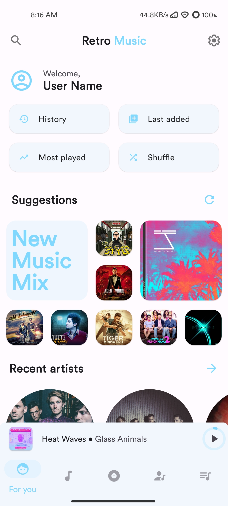
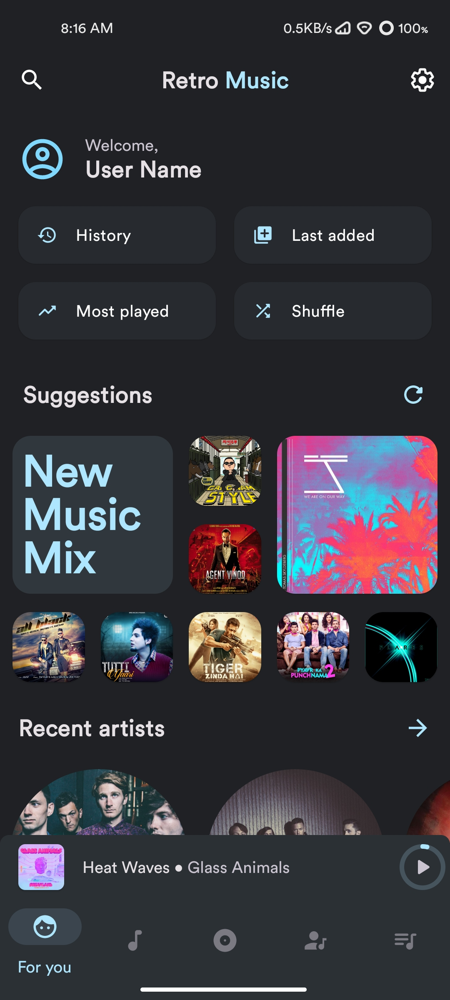
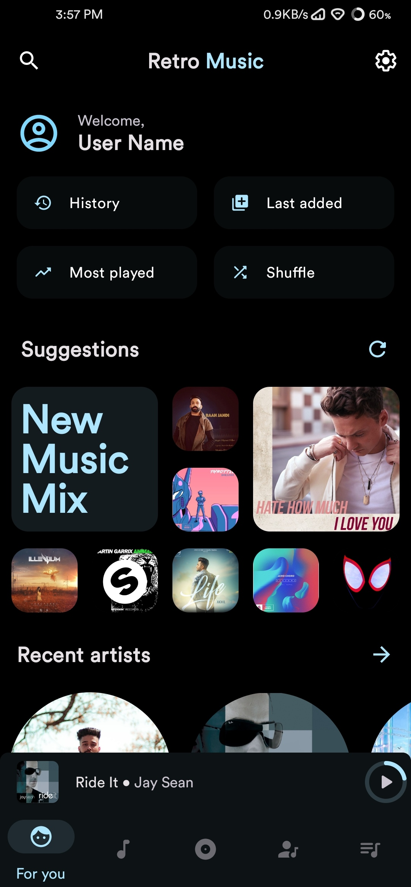
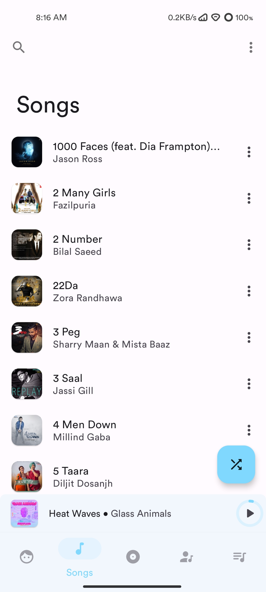

# Metro

Material Design music player for Android music lovers

## Downloads

## Differences between Metro and [RetroMusicPlayer](https://github.com/h4h13/RetroMusicPlayer)
- Google Play libraries removed (fully libre)
- Pro features available for free
- Bug fixes
- Minor differences in UI

## 📱 Screenshots
### App Themes
|  |  |  |
|:---:|:---:|:---:|
|Clearly white| Kinda dark | Just black|

### Player screen
| | | | | |
|:---:|:---:|:---:|:---:|:---:|
| Home | Songs | Albums | Artists | Settings |

### Synced lyrics screen (Over Cover)
| | | |
|:---:|:---:|:---:|
| Synced Over Cover light | Synced Over Cover dark | Synced Over Cover black |

### Synced lyrics screen (Replace Cover)
| | | |
|:---:|:---:|:---:|
| Synced Replace Cover light | Synced Replace Cover dark | Synced Replace Cover black |

### 10+ Now playing themes
| 	||     	|     	|     	|
|:-----:	|:-----:	|:-----:	|:-----:	|:-----:	|
| Normal 	| Fit 	| Flat 	| Color 	| Material 	|

| 	||     	|     	|     	|
|:-----:	|:-----:	|:-----:	|:-----:	|:-----:	|
| Classic 	| Adaptive 	| Blur 	| Tiny 	| Peek 	|

## 🧭 Navigation never made easier 
Self-explanatory interface without overloaded menus.

## 🎨 Colorful
You can choose between three different main themes: Clearly White, Kinda
Dark and Just Black for AMOLED displays. Select your favorite accent
color from a color palette.

## 🏠 Home
Where you can view your recently/top played artists, albums and
favorite songs. No other music player has this feature.

## 📦 Included Features
-  Base 3 themes (Clearly White, Kinda Dark and Just Black)
-  Choose from 10+ now playing themes
-  Driving Mode
-  Headset/Bluetooth support
-  Music duration filter
-  Android auto support
-  Wallpaper accent picker on Android 8.1+
-  Material You support on Android 12+
-  Monet themed icon support on Android 13+
-  Folder support - Play songs by folder
-  Gapless playback
-  Volume controls
-  Carousel effect for album covers
-  Home screen widgets
-  Lock screen playback controls
-  Lyrics screen (download and sync with music)
-  Sleep timer
-  Easy drag to sort playlist & play queue
-  Tag editor
-  Create, edit and import playlists
-  Playing queue with reorder
-  User profile
-  30+ languages support
-  Browse and play your music by songs, albums, artists, playlists and
  genre
-  Smart Auto Playlists - Recently played, most played and history
-  Build your playlist on the go

We are trying our best to bring you the best user experience. The app is regularly being updated for bug fixes and new features.

## 🗂️ License

Metro is released under the GNU General Public License v3.0
(GPLv3), which can be found [here](LICENSE.md)

> Please note: Metro is an offline music player app. It doesn't support music downloading or online music streaming.
