# Retro Music Player 🎵

## 🆕 Material Design music player for Android music lovers 

## ⚠ Join [@retromusiclog](https://t.me/retromusiclog) on Telegram for important updates.

## Screenshots
### App Themes
| 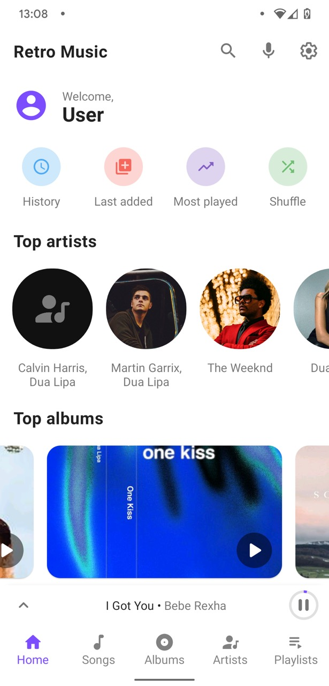 | 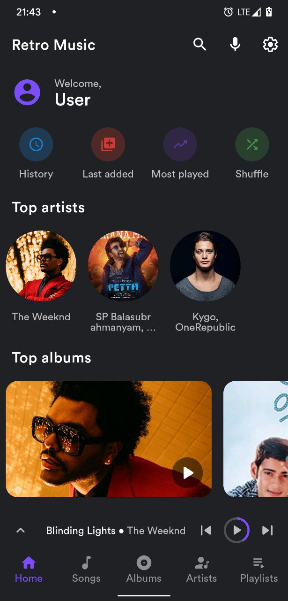 | 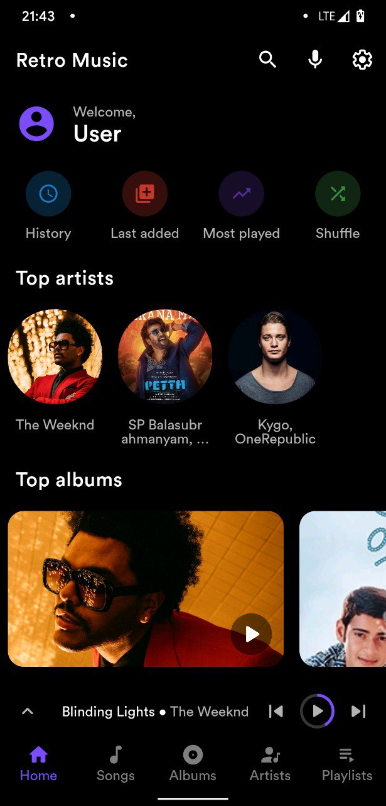 |
|:---:|:---:|:---:|
|Clearly white| Kinda dark | Just black|

### Player screen
| | 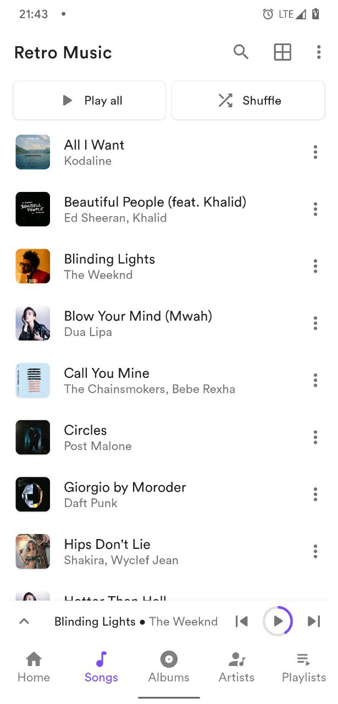| 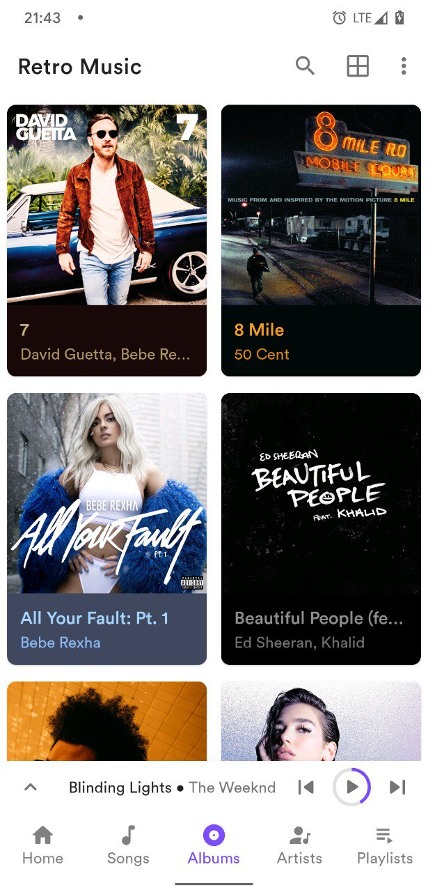| 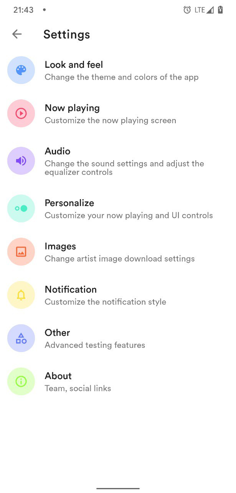|
|:---:|:---:|:---:|:---:|
| Home | Songs | Albums | Settings |

### 9+ Now playing themes
 
| 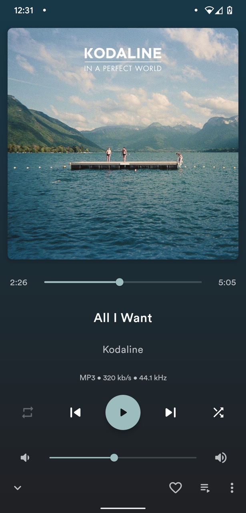	|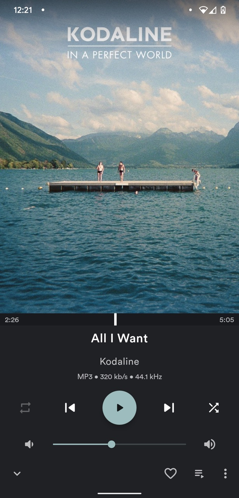|   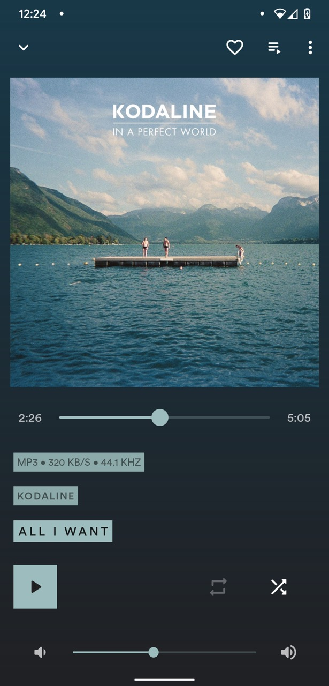  	|    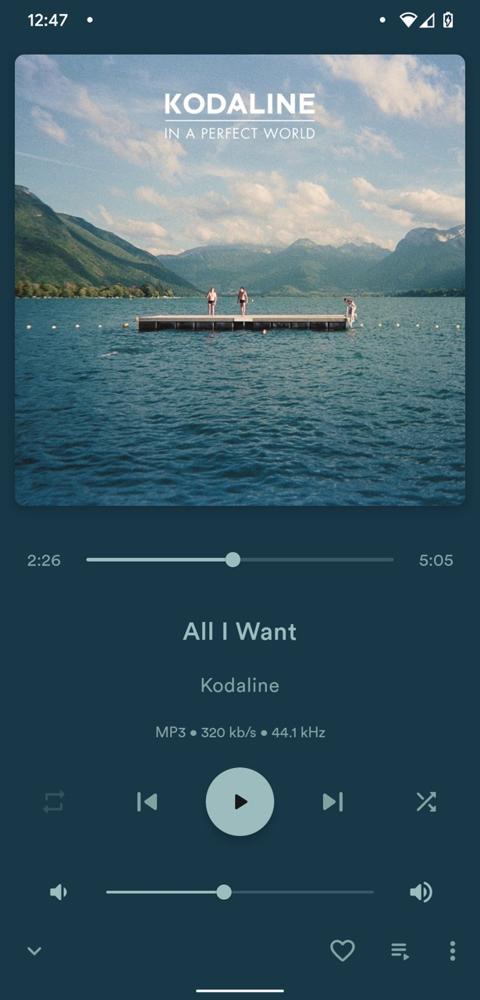 	|     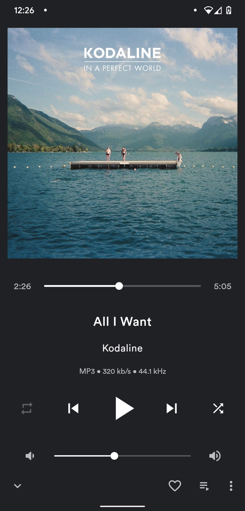	|
|:-----:	|:-----:	|:-----:	|:-----:	|:-----:	|
| Normal 	| Fit 	| Flat 	| Color 	| Material 	|

| 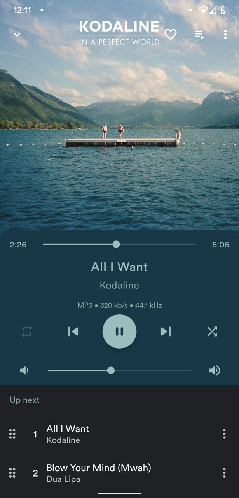	|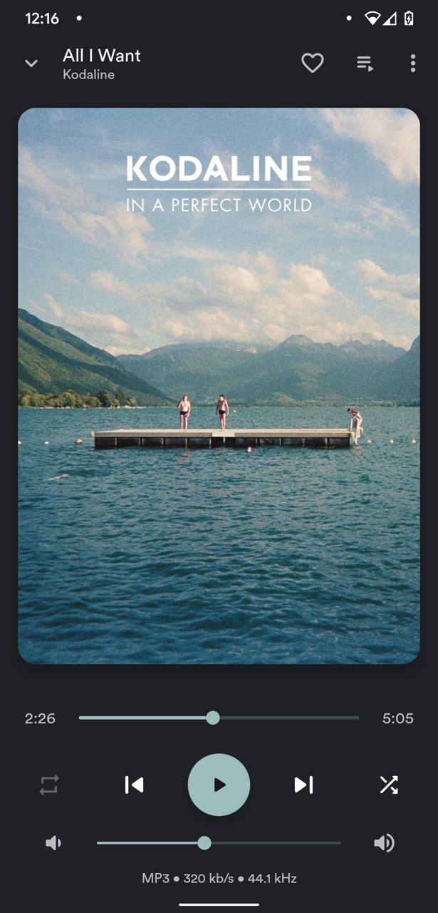|   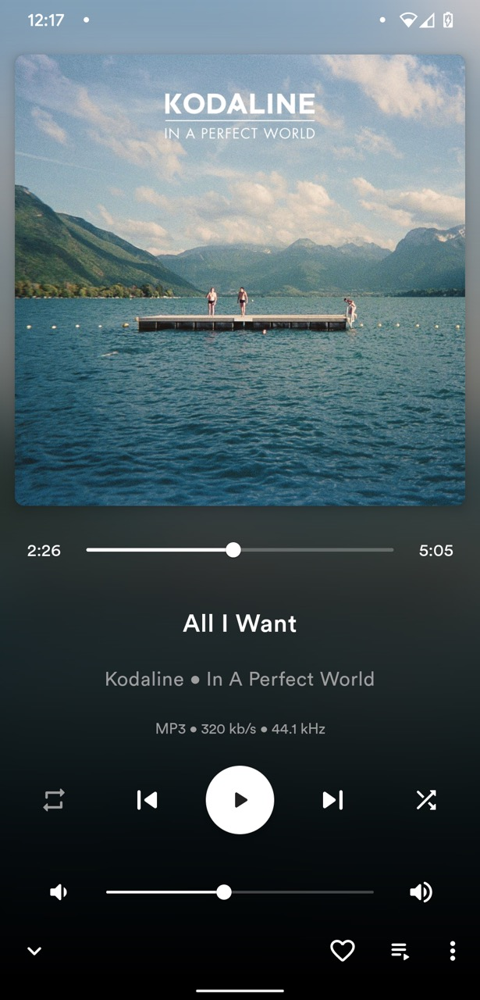  	|    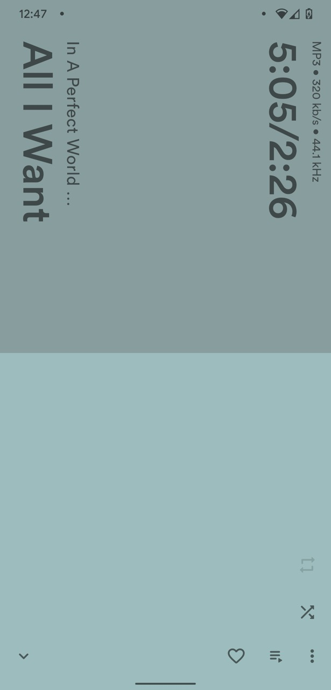 	|     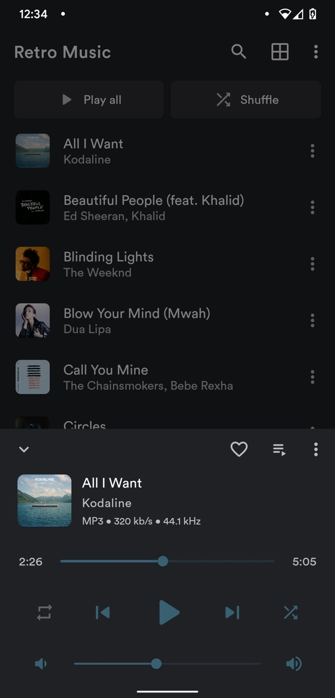	|
|:-----:	|:-----:	|:-----:	|:-----:	|:-----:	|
| Classic 	| Adaptive 	| Blur 	| Tiny 	| Peak 	|

### 🧭 Navigation never made easier 
Self-explanatory interface without overloaded menus.

### 🎨 Colorful
You can choose between three different main themes: Clearly White, Kinda
Dark and Just Black for AMOLED displays. Select your favorite accent
color from a color palette.

### 🏠 Home
Where you can view your recently/top played artists, albums and
favorite songs. No other music player has this feature.

### 📦 Included Features
-  Base 3 themes (Clearly White, Kinda Dark and Just Black)
-  Chromecast support
-  Choose from 10+ now playing themes
-  Driving Mode
-  Headset/Bluetooth support
-  Music duration filter
-  Folder support - Play songs by folder
-  Gapless playback
-  Volume controls
-  Carousel effect for album covers
-  Home screen widgets
-  Lock screen playback controls
-  Lyrics screen (download and sync with music)
-  Sleep timer
-  Easy drag to sort playlist & play queue
-  Tag editor
-  Create, edit and import playlists
-  Playing queue with reorder
-  User profile
-  30+ languages support (help translate the project: [Crowdin](https://crowdin.com/project/retromusicplayer)
-  Browse and play your music by songs, albums, artists, playlists and
  genre
-  Smart Auto Playlists - Recently played, most played and history
-  Build your playlist on the go

We are trying our best to bring you the best user experience. The app is regularly being updated for bug fixes and new features.

### ❓ FAQ
Please read the FAQ [here](https://retromusic.app/faq.html)

In any case, you find or notice any bugs please report them by creating an issue or by contacting us in the [Telegram group](https://t.me/retromusicapp).
If you have any feature suggestions, please create an issue with detailed information or by contacting us in the [Telegram group](https://t.me/retro_music_suggestion).

### 🔗 Social links
**Telegram:** https://t.me/retromusicapp  
**Instagram:** https://instagram.com/retromusicapp  
**Crowdin**: https://crowdin.com/project/retromusicplayer  
**Pinterest:** https://pinterest.com/retromusicapp  
**Twitter:** https://twitter.com/retromusicapp  

### 🗂️ License

Retro Music Player is released under the GNU General Public License v3.0
(GPLv3), which can be found [here](LICENSE.md)

>Please note: Retro Music Player is an offline music player app. It
>doesn't support music downloading or online music streaming.
